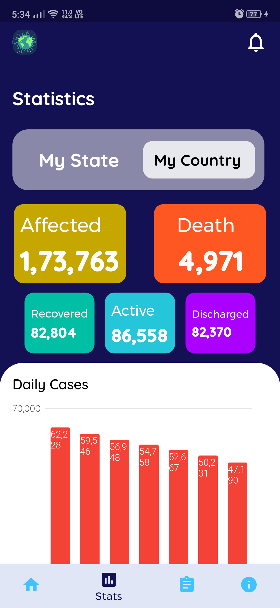
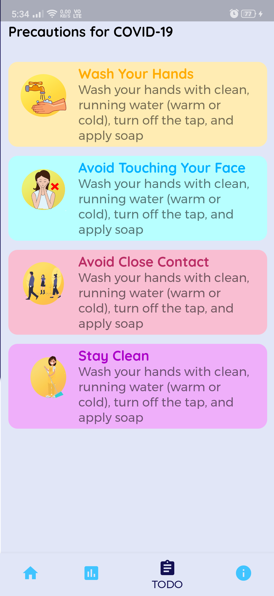

# COVID-19 App

### Introduction

A COVID Statistics checker app build with Flutter. App primararily focuses on statistics of Indian COVID cases and especially for **Maharashtra** state.

User can call for emergencies through home page or see daily affected CORONA patients data. Also, it provides a graphical representation [Bar Graph] of daily cases.

* The UI is inpired a lot from this [Dribble](https://dribbble.com/shots/11015463-Covid-19-App-Free) post.
* API consumed for this app : [Indian COVID API](https://github.com/amodm/api-covid19-in).
* The image resources used in this app are from [Pexels](https://www.pexels.com/).

### Some Glimpse

  
   
  

>Made with love by **Utkarsh** :heart:

>*This app is built with sole intention of exploring and showcasing UI skills :relaxed:*